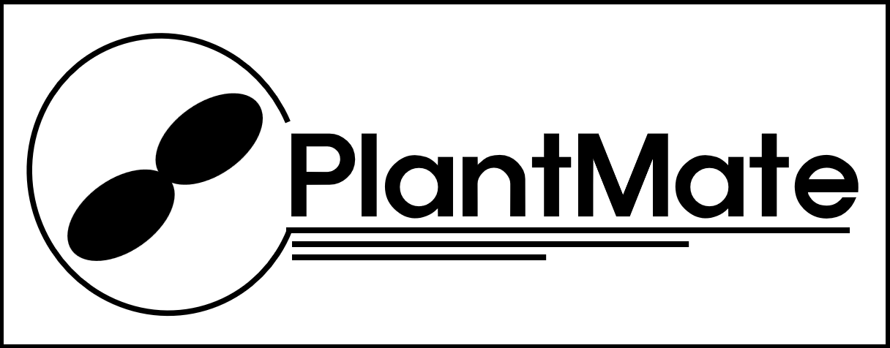

    

## Description
A **smart irrigation system** + **environmental monitor** project that uses embedded technology to alert the user of a plants watering needs, as well as gathering a plants environmental data. 

## Purpose
The purpose of **PlantMate** is to not only provide plant owners with an automated watering system for their plants, but also to give plant owners an idea of the environmental conditions their plant is subject to. 

Some outdoor plant owners can often neglect their plants, especially during dry periods throughout the growing season. This can be problematic if plant owners have dozens of outdoor plants (like me), and they can't be asked watering all of them with a garden hose. Because of this a lot of people may become hesistant to become long-term plant owners (especially long-term outdoor plant owners). 

Another part of the problem is that outdoor plant owners may not have a definitive understanding of the environment of their plants. To change all of this, **PlantMate** aims to be a portable product that can help outdoor plant owners monitor their plants as well as provide them with efficent care. 

**PlantMate** is a (to be) automatic plant monitoring system that does the following:

- Monitor temperature, humidity, and soil moisture
- Changes displayed info through button press
