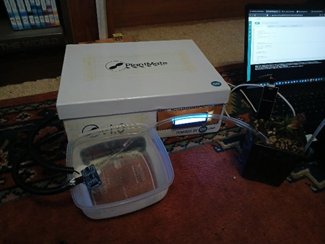
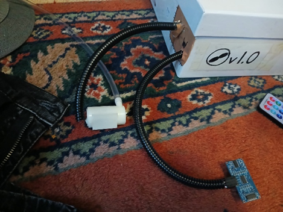
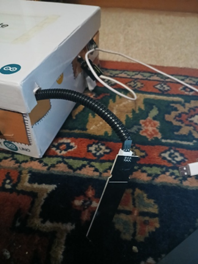
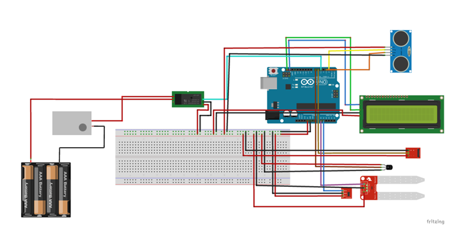

    

## Description
A **smart irrigation system** + **environmental monitor** project that uses embedded technology to alert the user of a plants watering needs, as well as gathering a plants environmental data. 

## Purpose
The purpose of **PlantMate** is to not only provide plant owners with an automated watering system for their plants, but also to give plant owners an idea of the environmental conditions their plant is subject to. 

Some plant owners can often neglect their plants, especially during dry periods throughout the growing season. This can be problematic if plant owners have dozens of outdoor plants (like me), and they can't be asked watering all of them with a garden hose. Because of this a lot of people may become hesistant to become long-term plant owners (especially long-term outdoor plant owners). 

Another part of the problem is that plant owners may not have a definitive understanding of the environment of their plants. To change all of this, **PlantMate** aims to be a portable product that can help plant owners monitor their plants as well as provide them with efficent care. 

**PlantMate** will be an automatic plant monitoring system that does the following:

- Water the plant when its dry
- Monitor temperature, humidity, light levels, and soil moisture
- Changes displayed info through button press

| Component    | Pin # |
| -------- | ------- |
| Moisture Sensor  | A0    |
| Light Sensor | A1     |
| Water Level Sensor    | 2 & 3 |
| DHT22    | 7 |
| IR Receiver    | 6 |
| LCD    | SDA, SCL |
| Relay    | 5 |

## Final Project

**PlantMate** has been constructed into a somewhat professional box setup, mainly to hide the spaghettified mess that is my wiring setup. The LCD screen is on the right-hand side of the front face of the box. The pump is on the left-hand side of the box. And last of all the moisture, light, infrared and temperature/humidity sensors are on the right-hand side. 

### Remote-Control

The user can leverage the use of remote-control technology to navigate through the PlantMate menu provided by the LCD screen. The user can view their plant’s current soil moisture levels, as well as temperature, humidity etc.

### Notifications

The project also has functionality on the cloud where the user is alerted on their phone, about whether their plant is dry, the water pump is running and if the water container is empty. The user can also dynamically update the max water level on the PlantMate dashboard.

### Local instance of PlantMate

If the user doesn’t want to use and interact with PlantMate via the cloud, they can utilize the code provided in the **Project** directory of this repo and upload that code via the Arduino IDE.

## Future Scope
The future scope for this project would be to more instances of PlantMate, basically have 3 to 4 or more small containers. This way I will be able to apply PlantMate as a better real-world product, without the size of the product being a big problem. Note it would also be good in the future to have a considerably smaller version of PlantMate as well.

One of my friends suggested possibly for the future, I could utilize a capacitive soil moisture module that contains a built in ESP32 and DHT11 sensor and runs on an 18650 battery. From this I gathered this will be very handy when applying PlantMate on a somewhat larger commercial scale.

## Circuit Diagram

The soil moisture sensor, light sensor, DHT22 and i2C controller for the LCD not shown as Fritzing did not have the parts.